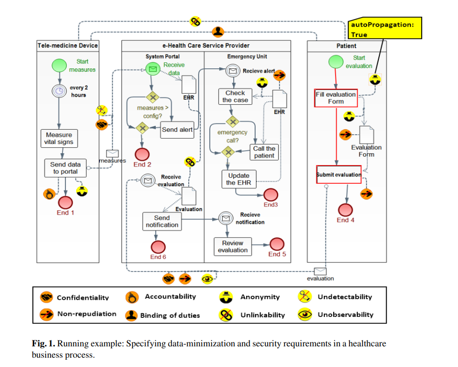

#this is a new sentence from github

# from gighub...This is page2 modified from gitbook

## Getting Super Powers 222

Becoming a super hero is a fairly straight forward process:

```text
$ give me super-powers 22222
```


Super-powers are granted randomly so please submit an issue if you're not happy with yours.




Once you're strong enough, save the world:


```bash
# Ain't no code for that yet, sorry
echo 'You got to trust me on this, I saved the world'
```


